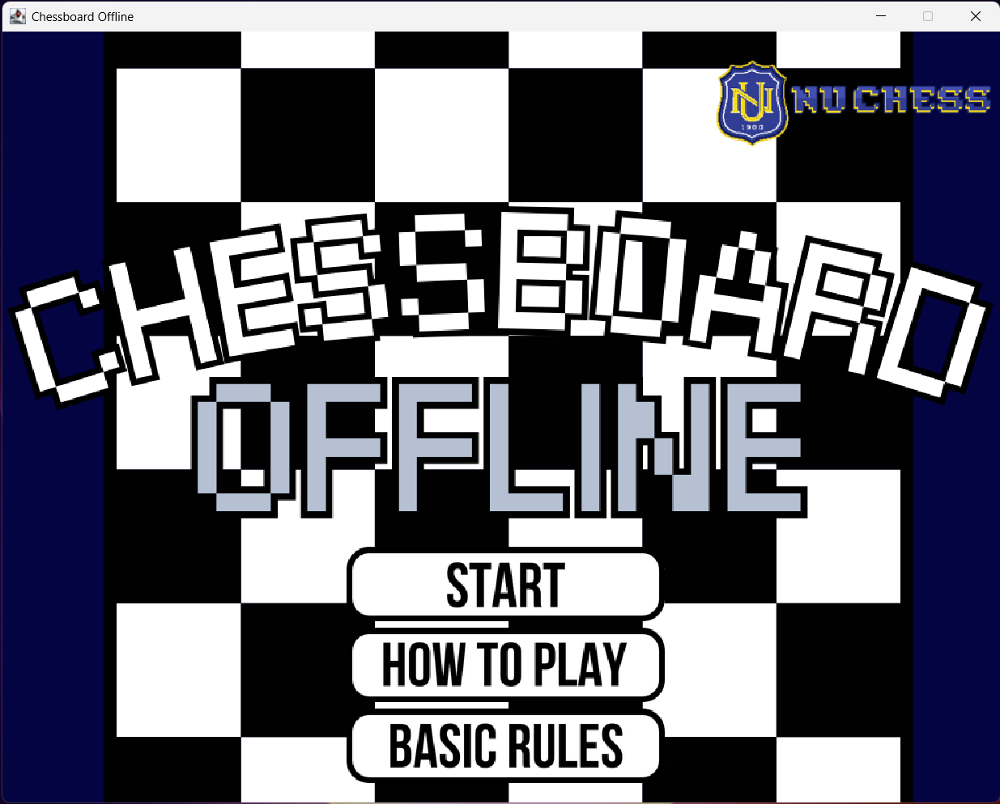
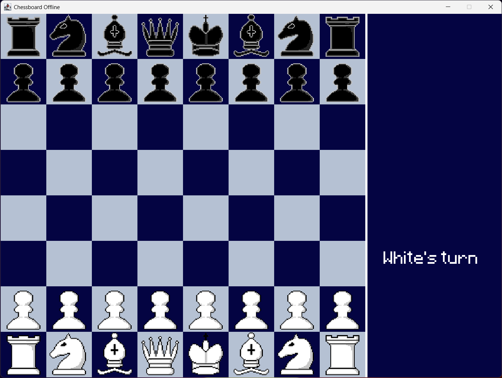

# ♟️🐶 Offline NU Chess Game 
NU Chess Game is an **offline**, two-player chess application built in Java using Swing. It enforces all standard chess rules. The game features smooth rendering, drag-and-drop piece movement, and visual indicators for turns and illegal moves.

## 🚀 Features
- Local Two-Player Chess Gameplay
- Full Chess Rules Implementation:
    - Legal move validation
    - Castling
    - Pawn promotion (Rook, Knight, Bishop, Queen)
    - Check, Checkmate, and Stalemate detection
- Visual Feedback for Moves:
    - Highlight possible and illegal moves
    - Turn indicators
    - End-game messages
- Smooth 60 FPS gameplay
- Mouse drag-and-drop control for chess piece movement

## 🛠️ Technologies Used
- **Language**: Java (Java 8+)
- **GUI**: Swing, AWT
- **Graphics**: Java 2D API

## 🧑‍💻 Team Members
- **[Iya](https://github.com/sophialeighahorro)** - Assets Designer
- **[Marygail](https://github.com/mariiimiau)** - Assets Designer
- **[Aisle](https://github.com/inthehallways)** - Programmer
- **[Aki](https://github.com/private-staticvoid)** - Programmer

## 🏆 Sample Game Interface

  
  

> NOTE: Offline Chess Game is a school project developed purely for educational purposes. All code, designs, and features were built for learning and demonstration.